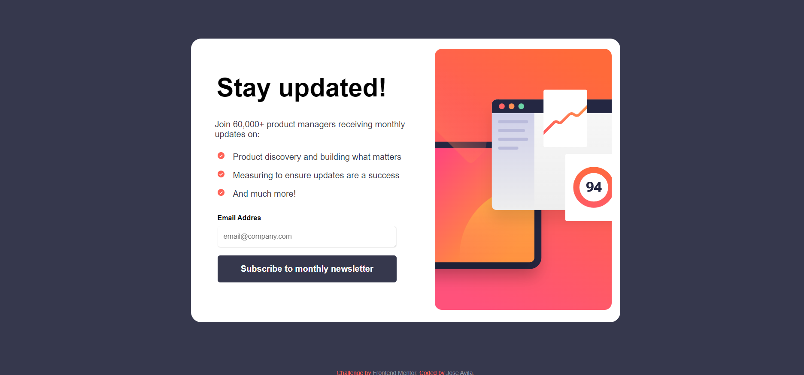

# Frontend Mentor - Newsletter sign-up form with success message solution

This is a solution to the [Newsletter sign-up form with success message challenge on Frontend Mentor](https://www.frontendmentor.io/challenges/newsletter-signup-form-with-success-message-3FC1AZbNrv). Frontend Mentor challenges help you improve your coding skills by building realistic projects. 

## Table of contents

- [Overview](#overview)
  - [The challenge](#the-challenge)
  - [Screenshot](#screenshot)
  - [Links](#links)
- [My process](#my-process)
  - [Built with](#built-with)
  - [What I learned](#what-i-learned)
  - [Continued development](#continued-development)
  - [Useful resources](#useful-resources)
- [Author](#author)
- [Acknowledgments](#acknowledgments)

## Overview

This was the second challenge I made from Frontend Mentor to keep getting better at my design skills because I am looking to become a frontend developer. For this one I just used Html, Css and a bit of JS as they are the foundations of the web development technologies. The concept of the exercise was simple, you have to make a newsletter that after putting your email in it will give a confirmation message saying you have been enrolled for updates from a website.

### The challenge

Users should be able to:

- View the optimal layout for the app depending on their device's screen size
- See hover states for all interactive elements on the page
- Calculate the correct tip and total cost of the bill per person

### Screenshot

### Links

- Solution URL: [Add solution URL here](https://your-solution-url.com)
- Live Site URL: [Add live site URL here](https://your-live-site-url.com)

## My process
I designed the HTML layout first, I applied the styles for desktop and then resized it with media queries for the mobile version. After having all the interface ready I added the Javascript functionalities.

### Built with

- Semantic HTML5 markup
- CSS custom properties
- Flexbox
- Javascript

### What I learned

I had some troubles passing the email value from the greeting form to the success card component. After making some digging I realized I could achieve that by using session storage which was pretty easy to use. Along the way I stumbled too with LocalStorage but I decided it was not what I was looking for for this exercise.

### Continued development

This is the second exercise I've made for Frontend Mentor, it helped me a lot to better understand the boxing model, I had to toy a lot margin and padding to really understand what I was doing and how position everything in a away that matched the picture references.

### Useful resources

- [MDN](https://developer.mozilla.org/es/) - This helped me for XYZ reason. I really liked this pattern and will use it going forward.
- [W3Schools CSS](https://www.w3schools.com/css/) - Having always a bit code to mess with and make sure of understanding a property comes very handy.

## Author

- Website - [Jose Ávila](https://github.com/javila26)
- Frontend Mentor - [@javila26](https://www.frontendmentor.io/profile/javila26)

## Acknowledgments

Shoutout to my friends who had helped me by being my testers in their phones and computers